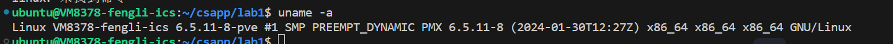
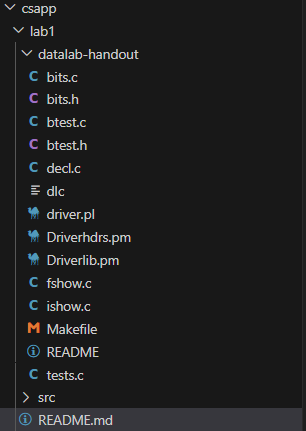
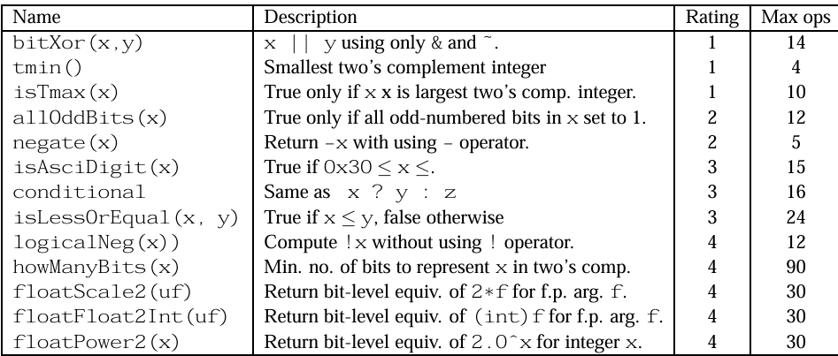
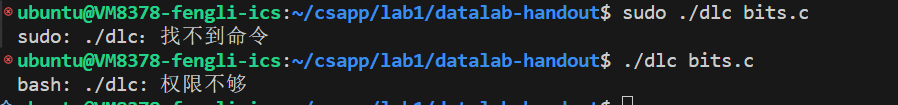
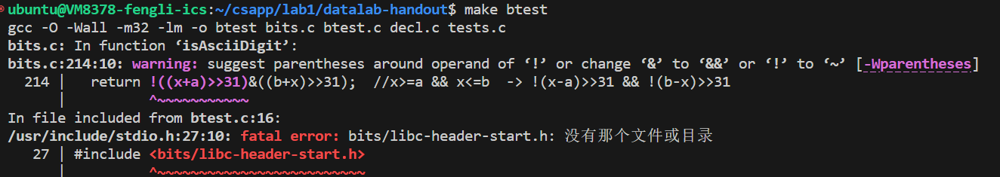
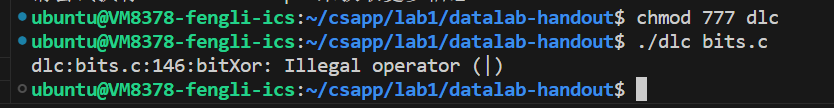
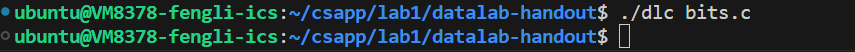
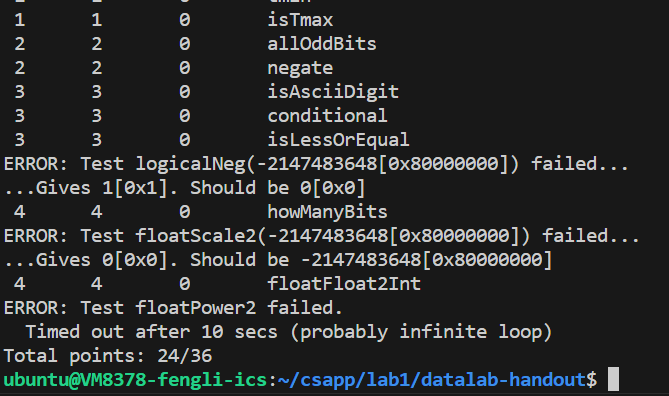
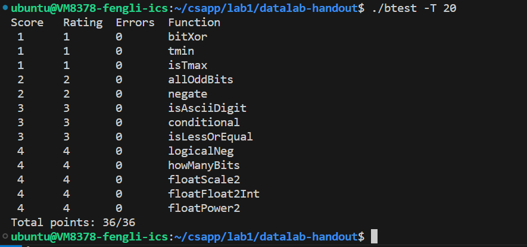
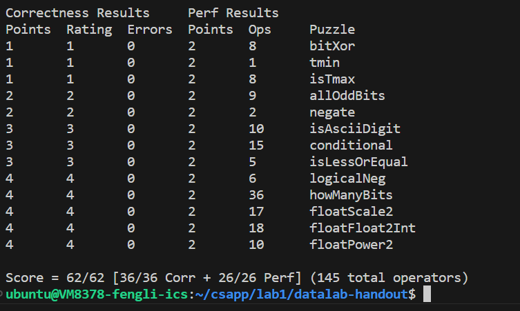

<style>
img{
     max-width:  400px 
     width: 50%;
     padding-left: 0%;
}
</style>

#     <center>lab1
#### <center>2024/3/22
#### <center>PB22111702 李岱峰

## 一.实验准备
linux环境准备就绪，配置如下：



从网站上下载得到代码包，解压在文件夹里，文件组织如下：




以上，准备完成。

## 二.任务分析



 1. 我需要使用bit操作，仅能使用"！ ~ & ^ | + << >>

 2. 我只能使用顺序语言，除特殊外不能跳转语句(loop)，条件判句(if)

 3. 不使用stdio中的函数。

 4. 完成所有操作

 ## 三.实验过程
 ### 1. 完成实验代码bits.c，实验原码请参考文件夹，这里只展示我认为很有收获的操作：
 1. 三目运算符 x?y:z，第一次见到这样的bits操作，使用减法将该减去的结果(y,z)减去即可。
``` C++
int conditional(int x, int y, int z) {  //x==0?z:y   x!=0  -> 0xffffffff|y  x==0 -> 0x00000000 ->~x|z
  int a=!!(x^0); //a=0 if x=0 else a =1
  int b=~a+1;    //b=0xffffffff if x=0 else b=0x00000000
  int c=~(y&~b)+1;
  int d=~(z&b)+1;
  return y+z+c+d;
}
```

2. 查位数的bits级操作，二分法从高位开始找
```C++
int howManyBits(int x) {
    int b16,b8,b4,b2,b1,b0;
    int flag=x>>31;
    x=(flag&~x)|(~flag&x);   //x>=0不变 ,x<0按位取反
    b16=(!!(x>>16)) <<4;       //如果高16位不为0,则我们让b16=16
    x>>=b16;                   //如果高16位不为0 则右移动16位 来看高16位的情况
    b8=(!!(x>>8))<<3;
    x >>= b8;
    b4 =(!!(x>>4))<<2;
    x >>= b4;
    b2=(!!(x>>2))<<1;
    x >>= b2;
    b1=!!(x>>1);
    x>>= b1;
    b0=x;
  return b0+b1+b2+b4+b8+b16+1;//加1是因为符号位,其他的是从低开始1的位数，从后向前找，不重不漏
}

```


 ### 2. 进行编译检查，包括符号是否正确和运行结果是否正确
#### 1. 准备工作中的错误：
 

                      权限不足，使用chmod指令赋予权限后成功

 

                    查明是缺少必要的库，在linux中更新lib库解决

#### 2. 符号使用：
   1.  第一次编译出错
   
   

                   查明是在bitXor中使用了不该使用的操作符所致
   2. 第二次编译正确
 
 #### 3. 运行结果
  1. 第一次运行   

 
          三个函数错误，错误原因如图。其中第三个问题无法解决，就修改了运行时间，加参数-T 20
 2. 修好后运行
   
                
                                       问题纠正

### 3. 最终测试

需要注意的是，我将测试最后一个函数的运行时间提高到了20，否则无法在响应时间内通过测试。



拿到了全部的分数。


## 四 .总结

bits实验很有趣，可以获得一些前所未有的编程体验。同时也丰富了如makefile、linux chmod的使用经验。