<style>
img{
     max-width:  400px 
     width: 50%;
     padding-left: 0%;
     
}
</style>

#     <center>lab2
#### <center>2024/3/24
#### <center>PB22111702 李岱峰

## 一.实验准备

阅读说明文档，发现需要使用gdb调试，故找到校方的gdb调试summary，共17页打印阅读。

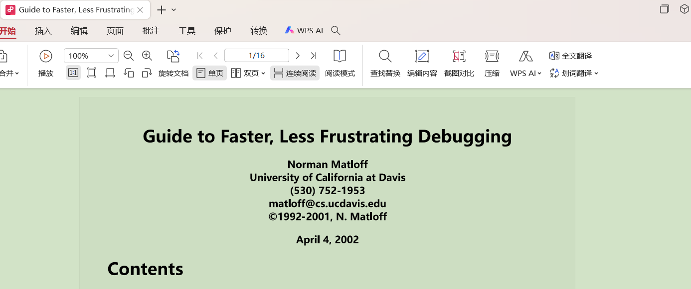

linux环境准备就绪，配置如下：


文件已经就绪，文件树如下：

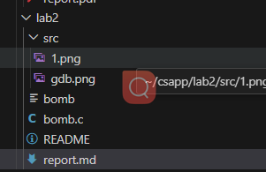

## 二.实验过程

### 1. 尝试
首先我尝试使用gdb disassemble /m main ，看到了main函数的汇编代码，然而这没有什么用

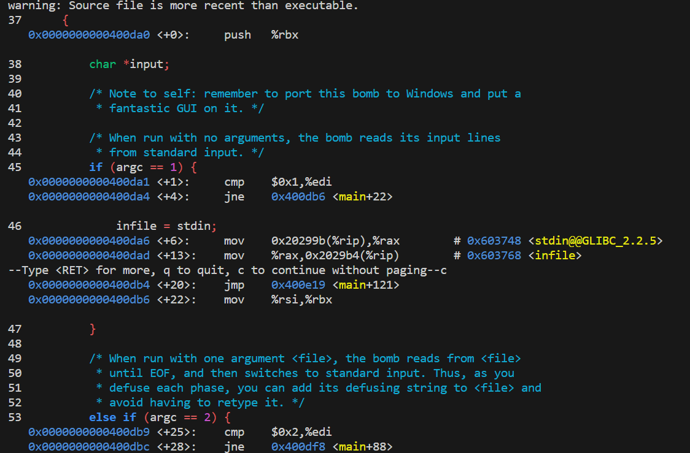
 
### 2. 解析字符串1


尝试解析一个未知的函数，得到如上图结果，可以得知第一个炸弹的输入函数是将一个字符串传入，然后call了一个比较字符串的函数，test检验函数然后得到结果。

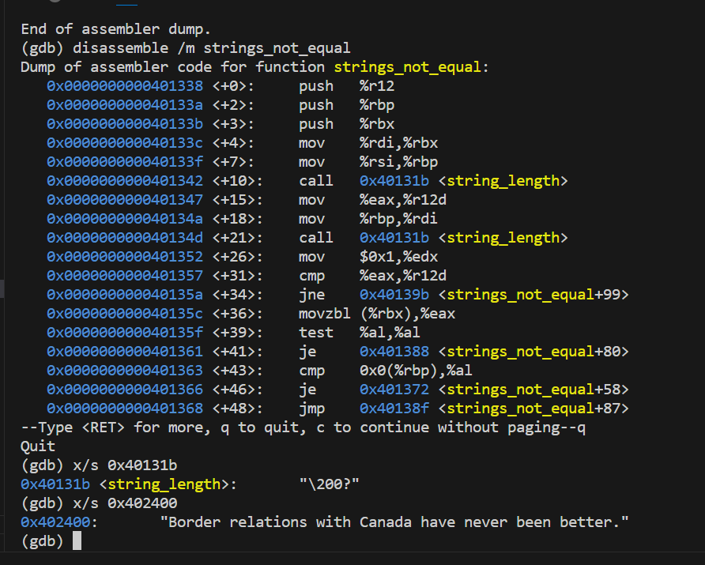

查看第一个密码。阅读该函数我们得知，phase_1从0x402400处mov了一个字符串上来，调用了字符串比较程序(call 0x401338)
esi寄存器中就是等待被比较的字符串，

### 3. 解析字符串2

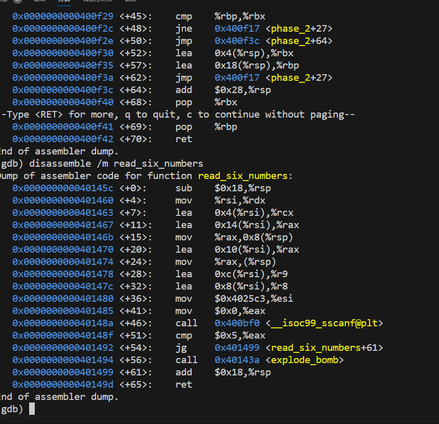

仔细阅读代码。

阅读教材，发现该函数逻辑为：rsp减0x28(分配栈)，将栈帧给rsi，然后读6个数字，最后比较rsp栈帧指向的数据是否为1，经过某些比较后，程序有跳转到phase_2+27和phase_2+52、phase_2+41、phase_2+64。其中+41是add指令，这里会进行栈帧的移动，移动到下一个内存空间，然后进行+45行的某种比较判断。整体是一个循环过程，猜测为比较6个数字，一个一个比较。

观察到循环过程为在读完数字后:+18 跳转 +52 顺序 +62 跳转 +27 顺序 +34 跳转 +41 顺序 +48 跳转回+27.  当6个数字读完后，+48后不再跳转+27 而是+50跳转+64，收回分配的栈空间。

根据循环，发现其中是在对%eax,(%rbx)在进行数值比较，是对%rbp和%rbx进行判段栈是否为空。

每次循环过程中，都有add eax+eax，说明密码中相邻数字扩大一倍，而从数字1开始(+14行说明)

得到密码：1 2 4 8 16 32

### 4. 解析字符串3


该程序中发现了大量的跳转，但每一个跳转都向下运行，指向phase_3+123,到达+123后是一个cmp比较，然后结束。说明输入应该是两个数，第一个数在+39中，比较0x7与0x8(%rsp)，如果输入的第一个数大于7，就引爆炸弹+106，所以第一个数是一个小于7的数

第二个数取决于第一个数，在+46后，第一个输入的数被导入%eax，并无条件间接跳转到M[imm+rax*8] 以这里面的值作为跳转目标，rax中值就是输入的第一个数。即第一数为1，则跳转到0x402478，观察到如下图，0x402478中存储的值是0x4024b9，跳转到+118，发现是move指令，给eax寄存器写入了0x137.如此第二个数就是0x137

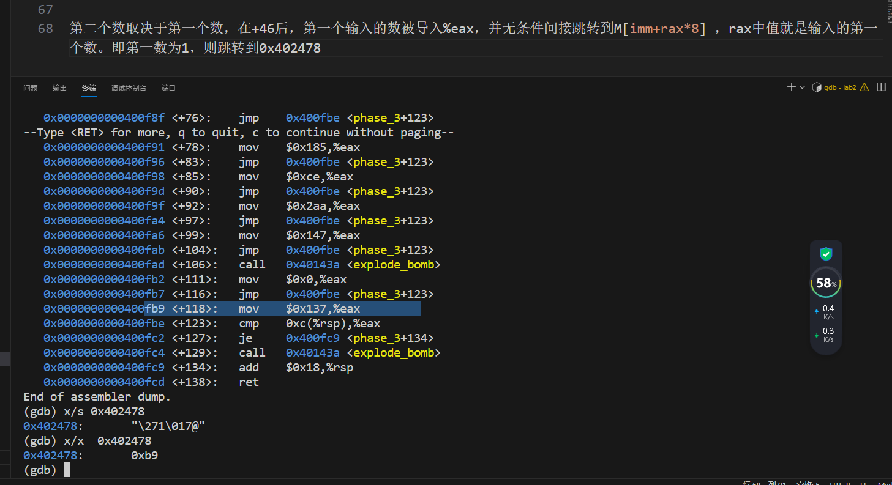

故密码为:1 311 (不唯一)

### 5. 解析字符串4

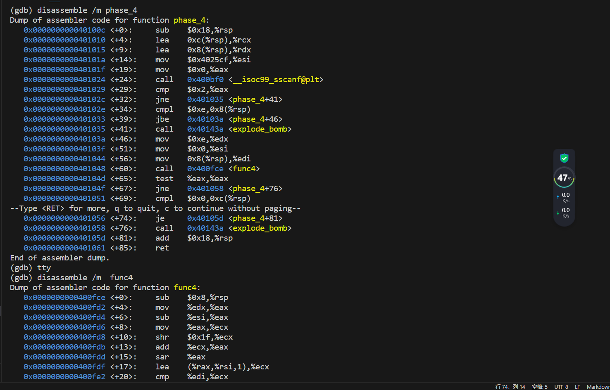

如图为bomb4的代码，同样的分配栈空间，从内存上提取数据，寄存器初始化后接收字符串，可以看到要求第一个数字小于等于0xe，并且第一个数字为%rdx ,第二个数字为%rcx,+29行标志一共有两个参数。

在+46行开始进行了三个mov，对edx，esi，edi进行了更改，此时在+60，%edx中是0xe，%esi是0x0,%edi中为%rdx即第一个数字。这三个东西作为func的参数被传入。在经过func函数后，判断eax中值是否为0，若不为0则爆炸，否则比较第二个数。若第二个数等于0x0则通过。

下面看func中的操作：

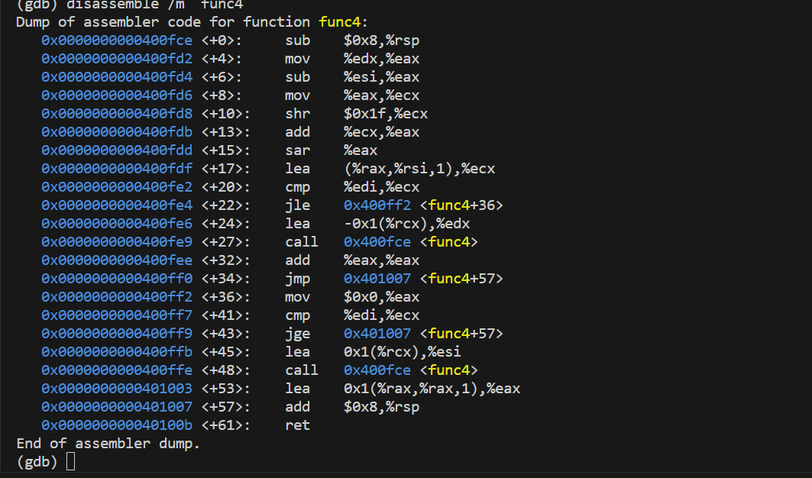

在func函数中，发现+27call了func，说明是一个递归函数。首先进入函数，分配空间，%eax=%edx=0xe,%eax=%eax-%esi=0xe,%ecx=%eax=0xe;

+10:%ecx>>>0x1f=>%ecx=0;(取符号)    

%eax=%ecx+%eax=0xe ;     

%eax>>1=>0111(b)  ;

%ecx=(%rax+%rsi*1)=0x7 ;

以上计算后，程序到达+20,是一个比较判断%edi,%ecx。根据上述，%edi是第一个数字，%ecx是0x7，如果两个值小于或相等，跳转+36。我们假设跳转成功，则%eax=0,比较%edi,%ecx，若大于或等于，继续跳转+57，函数结束ret。

根据上述发现0x7为递归终止条件(两个判断一个大于等于0x7，一个小于等于0x7)，则该函数入口参数，即第一个数字为0x7，返回phase_4.

如果递归没有进入，此时%eax为0x0，test结果为0，jne跳转不成立，进入cmpl比较，发现是0和第二个数进行比较，如果相等则跳转+81，成功。所以第二个操作数一定是0。

综上得到两个操作数：7 0 。

### 6. 解析字符串5

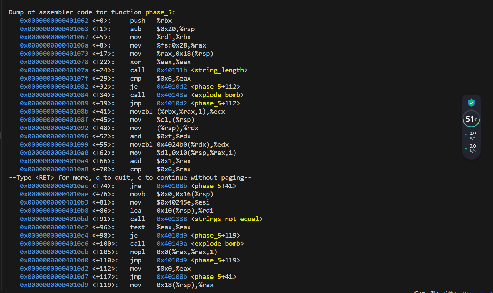

代码过长，不全文展示

首先观察到+29行，说明string_length应该为6。然后注意到+32行跳转+112行后再跳回+41行，是一个循环过程。循环的跳出条件在+98行，会将程序跳出至+119行，条件为%eax为0。综上，程序在+41行和+74行间循环，读入6个字符串后由+76行开始进行，调用字符串比较函数，如果%eax为0即字符串相等，到+119行进行栈越界检查，然后程序结束。

分析+41到+74的代码，总结如下：(在+41到+74内，%rax每次递增1，是计数器)

```C
for(int rax=0;rax<=6;rax++){
     long a=c[rbx+rax*1]                   //这里会把a的高32位置0   movzbl (%rbx,%rax,1),%ecx
    char tmp=a[7:0]                       // 
    //(rsp)=tmp tmp输入的第一个字符
    long rdx=tmp;                   //
    edx=edx&0xf //也就是只保存后4位        mov    (%rsp),%rdx  ; and    $0xf,%edx
    edx=m[0x4024b0+rdx] //这里的rdx里保存的就是我们输入的第一个字符   movzbl 0x4024b0(%rdx),%edx
    m(rsp+10+rax)=edx   //低8位               mov    %dl,0x10(%rsp,%rax,1)
}
``` 

这段代码的工作就是将输入的字符串一个一个取字符，然后将低八位存入rdx，再取后四位，加偏移量，在0x4024b0处找到相应位置，放到edx中，存入栈中。那么如下图，发现0x4024b0开始是一个字符串，显示"maduiersnfotvbylSo you think you can stop the bomb with ctrl-c, do you?"。那么我们输入的字符的作用就是用这些字符的ascll码后4位的数值作为偏移量，找到相应位置的字符，来形成一个新字符串，存在栈rsp中。


从上向下找密文所在位置，即提取出输入字符后，跟谁比较。从第+91行发现，在此调用比较函数，那在上面一定mov了一个字符串上来，调查0x40245e，


发现密文“flyers”。将每个字符在0x4024b0字符串出现位置(偏移量)找出，分别为：f=9,l=15,y=14,e=5,r=6,s=7.则ascll码中后4位bit位这6个数字的字符就是密码。

密码：0100_1001:I;0100_1111:O;0100_1110:N;0100_0101:E;0100_0110:F;0100_0111:G

IONEFG

### 7. 解析字符串6

太长了。


+18行揭示读入的是6个数字。这六个数字均不能大于6：(+39行)。+52、+56、+60是计数器，揭示着比较的出口。


+74行揭示了两个数组空间内的值不能相同，而且这里是一个双重循环：

```C
  if(a[i]>6) bomb!
  r12d+=1;                      //<+52>:    add    $0x1,%r12d
  if (r12d=6){call <phase_6+95>}    //<+56\+60>
  int ebx=r12d;                 //<+62>
  while(ebx<=5) {               //
    int rax=ebx;                   //<+65>    movslq %ebx,%rax
    int eax=a[rax*4+rsp];          //<+68>     mov    (%rsp,%rax,4),%eax
    if(eax==a[i]) bomb!;           //<+71><+74>
    else{               
      ebx+=1;                        //<+81>:    add    $0x1,%ebx
    }                   
  }
```
如此，这6个数均不能相同，且都小于等于6.然后跳转<+95>

<+95>开始，又是一个循环，这个循环出口是rsi==rax,跳转<+163>.循环内进行了%edx的操作，%edx=7-%rax,又将edx值写入rax，就是说当rsi!=rax时(rsi是非法栈帧，就是说数组没越界时)，将r14=7-r14。进行完毕后进入<+163>


来之前，esi清零。mov将数组第一个元素写入ecx，如果是1<=该元素，跳回<+143>.<143>给edx一个神奇的值0x6032d0，将rdx写给一个神奇的地址，然后切换到数组下一个元素，比较是否越界后进入<+163>.可见这里有一个神奇的循环。

所以开始查看0x6032d0这个神奇的值的意思。如下图

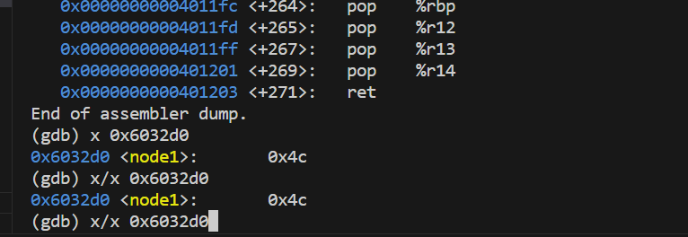

发现了node1，大概率是一个链表。而这个循环里给node附了值。从<+148>到<+169>讲述了给数组重排的规则.而<+181>到<+257>给出了链表连接的方式，具体逻辑我已伪代码形式给出：

```C
for(int i=1;i<=6;i++){
  if(a[i]==6)
      L[i]=node1; //L[i]表示我们新链表的第i个结点。
  else{
      int b=7-a[i],p=node1;
    while(b--){
      p=p->next;
    }
    L[i]=p; 
  }
}   

```

故而，重拍揭示了规则，经过上述逻辑重拍后，会得到全新的链表，并且由<+243>行注意，重拍后的链表一定是单调递减的。

总逻辑：我输入6个数，这六个数满足不大于6且互相不同，6个数会存放在一个给定的链表中，按照L[i]=node[7-a[i]]的方式，将旧链表中的数赋给新链表，并使新链表的结构满足数值单调递减。

6个节点存储的初始值情况如下：


观察到了6个节点的链表，发现排完序的链表应是node3>node4>node5>node6>node1>node2（比的是0x6032d0+n*0x10）

可以得到输入的序列应是

L[1]=node3=node[7-a[1]] a[1]=4;

L[2]=node4=node[7-a[2]] a[2]=3;

L[3]=node5=node[7-a[3]] a[3]=2;

L[4]=node6=node[7-a[4]] a[4]=1;

L[5]=node1=6;

L[6]=node2=node[7-a[6]] a[1]=5;

密码为4 3 2 1 6 5


## 实验结果和总结

### 1. 实验结果
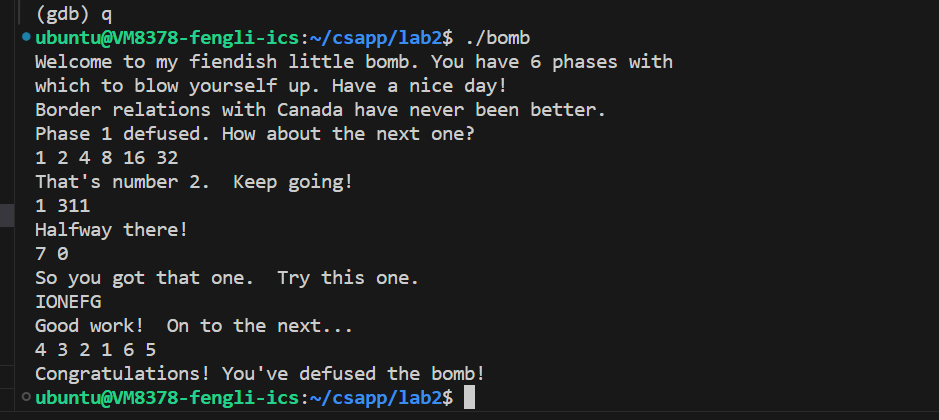

如上图，炸弹解除。

### 2. 总结

因为没有接触过x86这样的复杂指令集，从实验开始到结束用了整整两天。客观来讲，收获是极大的，x86堪称2天速成，各种取址方式都用到了，各种跳转，空间分配都见过了，甚至还有链表的存在，让我对链表的结构有了更深层次的认识。

该实验任务量大，难度高，出题诡异，但很有趣，收获多。

甚至在阅读解析时还发现有隐藏关卡，树的存在......

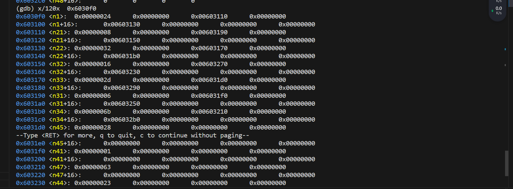

这未免太极端了。但原来树是这样存的。