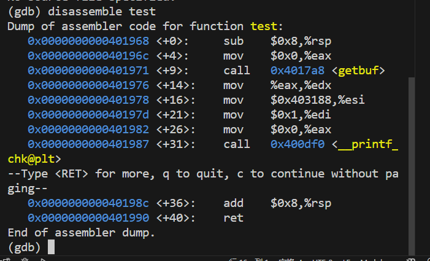

#     <center>lab3
#### <center>2024/4/7-2024/4/14
#### <center>PB22111702 李岱峰

## 一. 实验过程

### 第一个攻击

阅读文档，任务要求：利用缓冲区溢出，根据栈的结构，在test函数中的getbuf函数，输入字符串，引导程序进入touch1程序。



test函数如上
```C
 voidtest()
  {
    int  val;
    val=getbuf();
    printf("No exploit. Getbuf returned 0x%x\n",val);
  } 
```

c语言如上，即在getbuf后，不能出现"no exploit"的printf进程，应在getbuf内直接跳转离开。该操作的实现是靠栈帧内容的改变实现的(ret的操作地址)


touch1函数如上，发现地址0x4017c0。我们需要将ret的返回地址修改为0x4017c0.

根据学习得知栈分配结构,栈从下向上，调用函数时，先将返回地址压入栈中，然后为getbuf相关参数、需要的变量分配栈空间。并且由x86的小端存储结构，getbuf输入数据从低地址向高地址累加压入栈中，test函数位于高地址中，ret返回地址在getbuf函数地址最大端，所以我需要输入一堆数据，并在最后越界的输入地址0x4017c0，使ret能够去到touch1中。


getbuf函数如上，可见sub $0x28,%rsp分配了40个字节的内存空间，所以输入40个随意的字节，在41字节输入0x4017c0即可。

查到touch1代码地址为：0x4017c0

由此就有了思路，我们只需要输入41个字符，前40个字节将getbuf的栈空间填满，最后一个字节将返回值覆盖为0x4017c0即touch1的地址，这样，在getbuf执行ret指令后，程序就会跳转执行touch1函数。

x86采用小端存储，要注意输入字节的顺序

输入为：

00 00 00 00 00 00 00 00

00 00 00 00 00 00 00 00

00 00 00 00 00 00 00 00

00 00 00 00 00 00 00 00          

00 00 00 00 00 00 00 00

c0 17 40 00 00 00 00 00


### 第二个攻击


第二部分如上图，即进入touch2后，传入的参数%rdi与cookie要相等才行，就是说在调用完getbuf函数后，需要跳转到touch2，且传入值要修改。

所以攻击逻辑是，向代码中注入一段代码，注入代码完成修改参数寄存器rdi，并ret到touch2地址。而getbuf后首先需要跳转到注入代码去，所以还需要第一次攻击的技术，修改getbuf原有的ret地址rsp，使用栈溢出，将返回地址修改为注入代码地址。注入代码在getbuf分配的40个字节代码空间中。


如上图，找到touch2的地址0x4017ec cookie值为0x59b997fa，

故注入代码为：
```
mov $0x59b997fa, %rdi # cookie,
pushq $0x4017ec # touch2地址
ret
```
同时ret地址换为%rsp地址，为0x5561dc78

输入attack2.txt


### 第三个攻击


目标如上。s的位置是随机的，所以在char [110]中，写入内容的位置不确定，可能出现在任意地方，所以不能在getbuf中注入代码

movq    $0x5561dca8, %rdi

pushq   $0x4018fa

ret

将需要的cookie字符串的位置(test时rsp栈帧位置，即test栈顶)传给参数寄存器，然后将程序引入touch3.

故输入为注入代码内容(movq、pushq、ret)+0+注入代码地址(0x5561dc78)+cookie的ASCII表示


### 第四个攻击

使用ROP方法攻击。通过截取程序中的代码块(一小段可执行代码+ret)，来构成一个程序链，通过ret连接在一起

For Phase 4, you will repeat the attack of Phase 2.也就是说，要用"拼凑"代码的方式，完成
```
movq    $0x59b997fa, %rdi
pushq   $0x4017ec
ret
```
首先，rtarget只支持movq\popq\ret\nop所以上述代码段无法实现。所以需要用上述指令改造。
```
#cookie压入栈
pop %rdi
ret -> touch2
```
寻找这样类型的指令即可。

在farm.c中搜索我们需要的段，pop指令对应58**，ret为c3


936行指令58后是92然后才是ret，不行。所以可用928行，58 90 ret。
代表pop %rax, nop,ret

因为导向了rax，所以需要movq %rax, %rdi，对应48 89 c7，搜到4项，要求movq后必须c3，所以用944行


所以两个RET地址为0x4019ab,0x4019c5。同时还需要导向0x4017ec（touch），test中还应该有cookie字符串59b997fa，最后这些值应该在test内部，属于40个字符输入后的溢出区域。

得到答案attack4.txt


### 第五个攻击

要求像phase3一样，返回touch3函数。因为栈的位置随机分配，所以只能通过偏移量来确定cookie的位置。
```
movq    $0x5561dca8, %rdi
pushq   $0x4018fa
ret
```

提示需要使用956行的lea指令，故逻辑如下：

```
1.movq %rsp, %rax  //0x401aad
2.movq %rax, %rdi  //0x4019a2
3.popq %rax        //0x4019cc
4.movl %eax, %edx  //0x4019dd
5.movl %edx, %ecx  //0x401a70
6.movl %ecx, %esi  //0x401a13
7.lea    (%rdi,%rsi,1),%rax //0x4019d6
8.movq %rax, %rdi  //0x4019a2

```

输入为40个字节随意+1+2+3+0x48偏移量+4+5+6+7+8+touch3地址+cookie

输入attack5.txt即可


成功。

## 二.实验结果

输入的原始文本在ans文件夹中，attackx.txt，放入hex2raw输出的结果放在ans_finial中

实验结果的图片在src文件夹中，报告中有引用。

