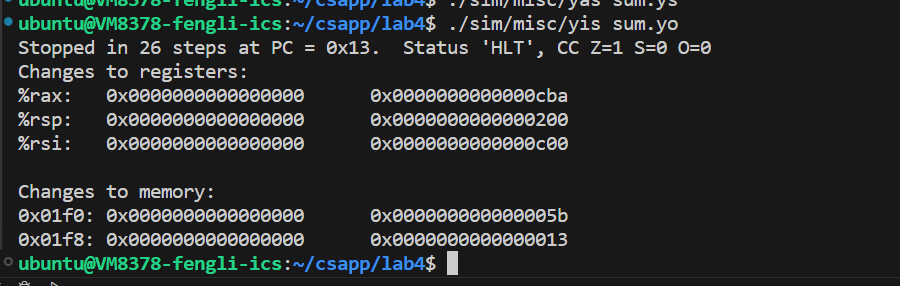

<style>
img{
     max-width:  400px 
     width: 50%;
     padding-left: 0%;
     
}
</style>

#     <center>lab4
#### <center>2024/4/20-2024/4/27
#### <center>PB22111702 李岱峰

# 严重警告：该程序需要lhdf5库，以及tk库(可不需要)，我在我的vlab平台上修改makefile，没有使用这两个库

## 一. 实验过程

阅读实验文档，作者设计了一款"新"指令集Y86，是X86的改版，阅读中文版深入理解计算机系统P256页，熟悉Y86.
### 准备阶段

4种mov：irmovq\rr\rm\mr:

>irmovq指令表示将一个立即数存进一个寄存器中 
>rrmovq指令表示将一个寄存器中的值存进一个寄存器中
>rmmovq指令表示将一个寄存器中的值存进一个内存地址所对应的内存中
>mrmovq指令表示将一个内存中的值存进一个寄存器中


>jmp	直接跳转
>jle	小于或等于 (有符号 <=)
>jl		小于 (有符号 <)
>je		相等 / 零
>jne		不相等 / 非零
>jge	大于或等于(有符号 >=)
>jg		大于(有符号 >)


传送指令：cmovle，cmovl，cmove，cmovne，cmovge，cmovg 

栈指令，call，ret等同x86

### PartA

#### 1.链表求和

文件目录：./sim/misc

```C++
long sum_list(list_ptr ls)
{
    long val = 0;
    while (ls) {
	val += ls->val;
	ls = ls->next;
    }
    return val;
}

```

取结点地址内容，add，判断链表是否遍历到末尾即可。



#### 2.递归链表求和

```C++
long rsum_list(list_ptr ls)
{
    if (!ls)
        return 0;
    else {
        long val = ls->val;
        long rest = rsum_list(ls->next);
        return val + rest;
    }
}
```
代码统一放在ans文件夹里。


#### 3.复制数组，计算每个元素的异或

```C++
long copy_block(long *src, long *dest, long len)
{
    long result = 0;
    while (len > 0) {
        long val = *src++;
        *dest++ = val;
        result ^= val;
        len--;
    }
    return result;
}
```


### PartB

#### 1.添加修改SEQ指令

>o extend the SEQ processor to support the iaddq, described in Homework problems
 4.51 and 4.52. To add this instructions, you will modify the file seq-full.hcl, which implements the
 version of SEQ described in the CS:APP3e textbook. In addition, it contains declarations of some constants
 that you will need for your solution.

 要求：实现iaddq指令（将立即数与寄存器相加）

 iaddq执行流程：

 >1.取指：mem[pc]->code,pc+=10

 >2.译码：Reg[rb],imm

 >3.执行：val_<-Reg[rb]+imm

 >4.访存：

 >5.写回：Reg[rb]<-val_

 按照上述流程修改./sim/seq/seq-full.hcl

 该程序设计很精巧，简化为询问每一个阶段这些指令作什么：Fetch阶段，向该程序中填写instr_valid中加入IIADDQ，表示该指令合法，need_regids中加入，表示该指令需要寄存器，need_valc中加入，表示该指令需要立即数，同时命名为valC。

 运行指令make testssim，得到结果

 

 
 


 

 如图，partb部分通过

 ### PartC
working in directory sim/pipe in this part

#### 1.修改 pipe-full.hcl ，使得该代码能够尽可能运行的更快
1.添加指令iaddq；

在pipe-full.hcl中找到了：
> Your task is to implement the iaddq instruction The file contains a declaration of the icodes for iaddq (IIADDQ) Your job is to add the rest of the logic to make it work


修改pipe-full.hcl，添加iaddq指令，添加方法同partb


2.加载转发

在重整完ncopy.ys后，我发现成绩跑不满，决定完成加载转发的设计。

正常来讲，在遇到load-use时，唯一的可能就是bubble一个周期，否则从内存load上的数据无法到达临近下一条指令的执行阶段(差一个周期，load访存时，下一条指令已经在执行).

但书中讲述了一个情况，就是当load的临近下一条是st时，st指令不会在执行阶段写数据，而是在访存阶段写数据，这就有了load上数据分出来一份转发给st指令的可能。无需bubble，节省一个周期。例如：

```
ld r1,r2
st r2,r1
```

在这里，只需将ld在访存后读出的数据，放到exmem阶段寄存器中就好，无需暂停一个周期。

由此，对pipe-full的load-use机制进行修改。268行，execute阶段后寄存器添加另一个路径。326、337、342行，更改stall、bubble机制，去掉irmmove和ipush的stall和bubble


最好成绩50.9分（还没满！？）

#### 2.重整ncopy.ys代码逻辑 ，使运行效果更快

代码C语言分析如下：

```C++
int ncopy(int *src, int *dst, int len)
{
    int count = 0;  //%rax
    int val;        //%r10

    while (len > 0) { //%rdx
        val = *src++;    //mem[%rdi++]
        *dst++ = val;    //mem[%rsi++]
        if (val > 0){
            count++;
            }   
        len--;
    }
    return count;
}

```

1.我先进行循环展开

尽可能减少循环发生的次数，因为branch类指令会导致流水线cpu停止一个周期，同时减少了条件判断的次数。

这里我实验6路展开，展开的意思是将一次循环复制一个数据变为一次循环复制6个数据。


如图，展开后成果如上。这个版本答案记录为partc_try1，保存在./ans中。

score 44.3/60 .


2.然后根据新ncopy.ys，发现循环减少后，跳转次数可以明显减少，这样就可以将分支预测改为不跳转。


如图，保留ICALL(call的跳转预测)，去掉IJXX，即取消原先的jump预测

在更改一些细节优化后（如减少跳转，减少气泡的出现概率）


此时运行最好成绩49.1，如图

## 二.总结

实验最终完成，parta，partb通过，但partc只拿到了50.9分(截至4.27)，实在找不到可以优化的点，或许运行程序的微调可以提高运行效率。
