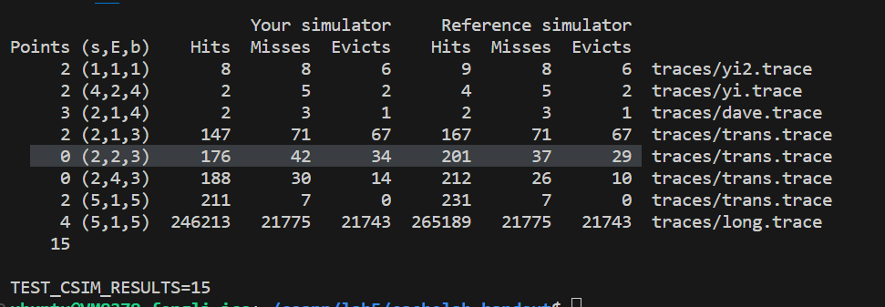
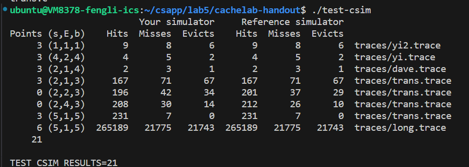
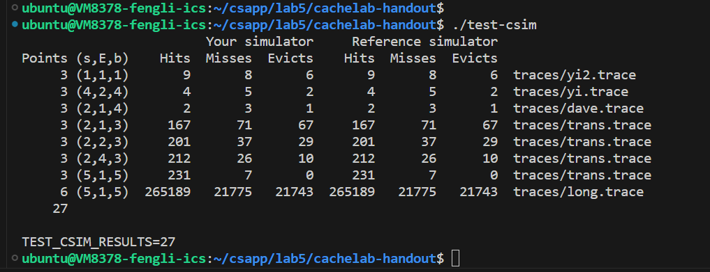
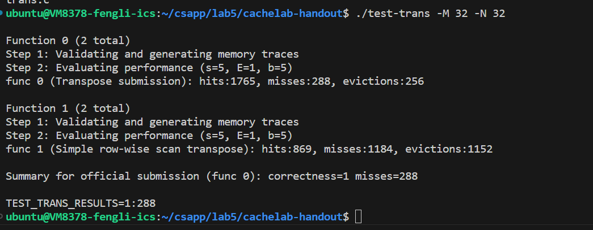
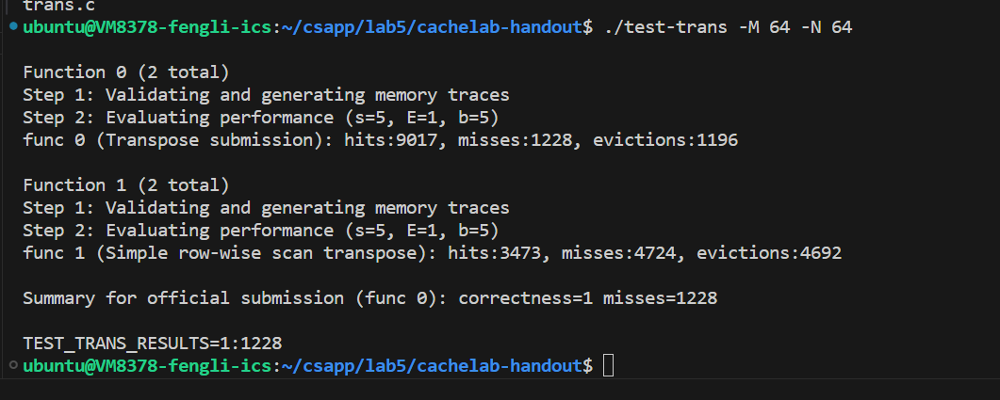
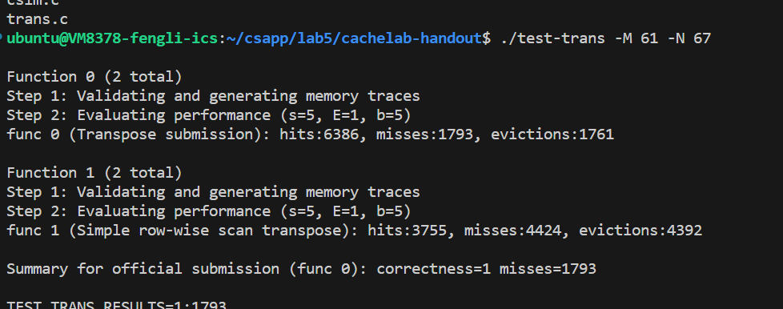

#    <center>lab5
#### <center>2024/5/16-5/19
#### <center>PB22111702 李岱峰

# 一.实验准备

阅读文档：

任务一：

>write a small C program (about 200-300 lines) that simulates the behavior of a cache memory.

任务二：

> optimize a small matrix transpose function, with the goal of minimizing the number of cache misses.

根据我在计算机组成原理学到的知识，建立cache模拟器。


根据实验要求，使用LRU最近最少策略，替换最后一次访问时间最久远的那一行，使用构建时间戳的方法。

# 二.实验过程

## 1.PartA cache模拟器

参数S：高速缓存组数，E：高速缓存行数，B：每个行是由多少个字节组成的数据块数。

### 1）定义cache：
```C
typedef struct {
    int valid;//有效位
    int tag;//tag
    int lru;//LRU算法时间戳
} Line;
typedef struct cache_{
    Line **lines;//多路组相连
    int S,E,B;//组数，每组行数，块大小
} Cache;
```

如图定义。

### 2）LRU实现
```C
void update_lru(int s,int index,int tag){//
    cache->lines[s][index].tag = tag;
    cache->lines[s][index].valid = 1;
    for(int i = 0; i < cache->E; i++){
        if(cache->lines[s][i].valid){
            if(cache->lines[s][i].lru < cache->lines[s][index].lru){//时间戳小于当前时间戳的行时间戳加1
                cache->lines[s][i].lru++;
            }
        }
    }
    cache->lines[s][index].lru = 0;
}

```
如上，每次更新时，将LRU的时间更新，时间越大说明很长时间没用这个单元，更新的时候就挑这个最大LRU单元更新。

### 3）hit与miss
```C
for(int i = 0; i < cache->E; i++){
        if(cache->lines[s][i].valid && cache->lines[s][i].tag == tag){
            return 1;
        }
    }
```

如上遍历整个cache，在标记为1，tag对应的情况下，说明一次命中，否则没有命中。由于该实验没有考察hit or miss后的运行，故不写。

### 4）get_trace

获取测试内容，统计测试结果

### 5）测试结果



如上，出问题了，不是满分。



修复一部分问题，M型读取应该是两次access

//if(cache->lines[s][i].lru < cache->lines[s][index].lru)这行替换策略错误，该测试认为LRU中，除被访问结点外的所有有效结点的lru_time都应加1，而不是只有最新访问点后的部分结点时间加一。实测miss数确实变小了，说明所有结点都加1更有效。我考虑是由于防止时间混乱，保持整体性设计的。



## 2.PartB 矩阵乘法

要求：在trans.c中编写矩阵转置函数，根据书中内容，我们要编写“对于cache友好”的程序。

> 32×32: 8points if m < 300, 0 points if m > 600
> 64×64: 8points if m < 1,300, 0 points if m > 2,000
> 61×67: 10points if m < 2,000, 0 points if m > 3,000

### 1）32*32
根据空间局部性和数组存储规则，数组同一行的数据是相邻的，按行读后如果按列赋值，那么就会是一整个列的miss。所以我们要尽可能避免按列操作。同时，我们的cache规定为(5,1,5)，意味着32路直接映射，每行32字节，一个int为4字节，所以每行8个int。

```C
void trans(int M, int N, int A[N][M], int B[M][N])
{
    int i, j, tmp;

    for (i = 0; i < N; i++) {
        for (j = 0; j < M; j++) {
            tmp = A[i][j];
            B[j][i] = tmp;
        }
    }    

}
```
这是提供的朴素的写法，可以见到B每次写都对应大量miss。

由于对全局变量有限制，写操作也没有办法绕过高速缓存限制，所以考虑分块转置。将大矩阵分成与cache大小接近的块，一块一块转置。比如，将A矩阵第一行读进来，32*32的矩阵一行32个元素，占用cache4行，cache还剩28行，用这28行来写B，其中B的第一列第一个元素miss后，他的右侧相邻元素应该也进入cache，每次miss进入8个元素，为B的0-8列，这些对应A的0-8行，且B的miss能保证miss有28次而不会覆盖有效信息，这意味着B的第一例无法完全读进来，只能分块读取。

也就是说，对于32*32位矩阵，我们对矩阵进行分块，8*8元素进行分块，我们获得a[0][0]-a[0][7]，然后将这些元素存入b[0][0]-b[7][0]，然后获得a[1][0]-a[1][7]，存入b[0][1]-b[7][1]，依次类推，可以减少大量的miss，只有第一行一列出现miss，剩下的元素都能在cache中找到。




miss 288次 满分

然而测试64*64，miss 4612次

### 2）64*64

根据32*32解法显然是失败的。由于61*67，分块只能进一步精细，否则8*8分块后没有起到优化效果，每4行就会出现大量miss。

将每个8*8分块再次细分为4个小块处理。这样就保证了最高的利用率。



### 3）61*67

使用第一部分代码即可



## 实验结果

缺少python2环境，无法运行driver.py，故每一部分截图如下：


