<style>
img{
     max-width:  400px 
     width: 50%;
     padding-left: 0%;
     
}
</style>

#     <center>lab6
#### <center>2024/5/1
#### <center>PB22111702 李岱峰

由于操作系统H课要求我写一个shell，其中要求了信号处理，我认为该实验有助于我更深入理解shell信号处理知识，故提前完成shell lab。

# 一.实验准备

阅读csapp教材第八章，理解并发、信号处理

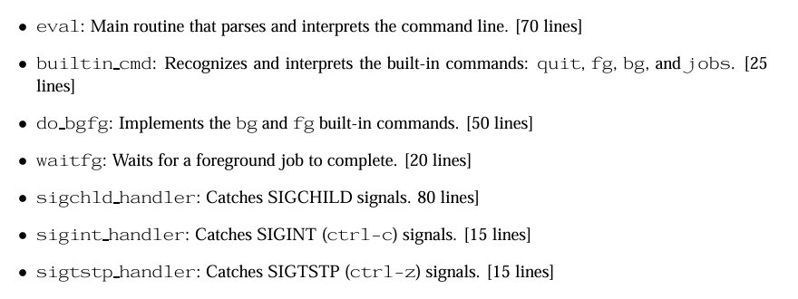

如上图要求，可以看到有对前后台要求和信号处理。

 Hints
 • Read every word of Chapter 8 (Exceptional Control Flow) in your textbook

 谢谢提醒。
# 二.实验流程

## 1.eval

解析输入命令，对应csapp书(中文版)P525页


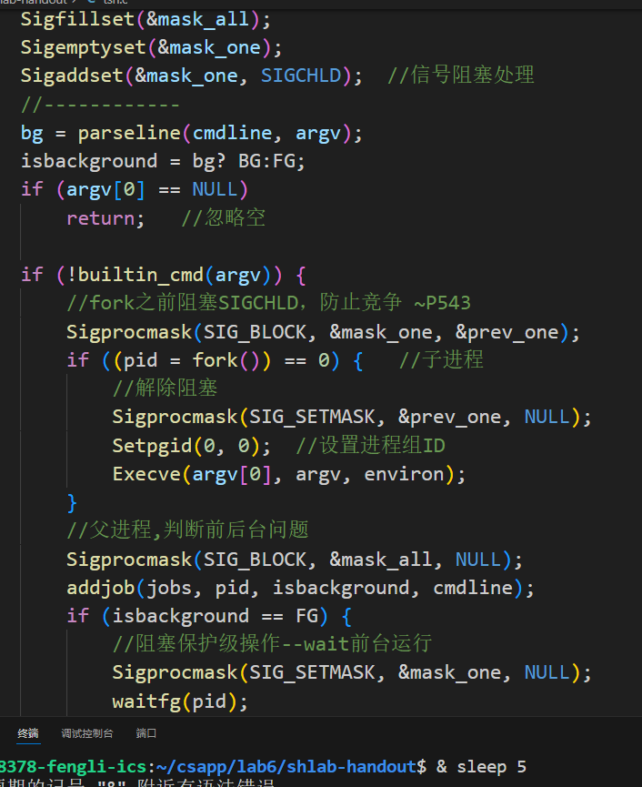

如图实现sigchld信号的阻塞，用于回收僵死进程

## 2.builtin_cmd

实现一下quit等内置命令即可，fg、bg、job都是调用函数。

## 3.do_bgfg

前后台进程调度

>bg <job>：通过向 <job>对应的作业发送SIGCONT信号来使它重启并放在后台运行

>fg <job>：通过向 <job>对应的作业发送SIGCONT信号来使它重启并放在前台运行

用kill来发送信号，用sigchld_handler接收信号，用fg、bg命令区分该任务应该放在前台还是后台，同时用指针修改jobs的值。

## 4.waitfg

前台运行信号的阻塞，书P545页。由于并发竞争问题，可以使用sleep或sigsuspend函数，这里使用sigsuspend，等价于

```
sigprocmask(SIG_SETMASK, &mask, &prev);
pause();//原子版
sigprocmask(SIG_SETMASK, &prev, NULL);
```
使用信号锁解决问题。

## 5.sigchld_handler
解决收到chld信号，即子进程执行完毕时，要回收所有僵死进程的操作。

对应书P543页,核心是安全的、阻塞所有信号时，进行jobs的更新(防止在jobs将要更新时，传来一个中断信号，导致进程回收失败，造成进程僵死)。

## 6.sigint_handler

INT是接收ctrl+c的信号，用kill来向前台进程组的所有进程传递该信号，注意需要阻塞所有信号安全操作

## 7.sigtstp_handler

tstp信号是来自终端的停止信号，ctrl+z。操作同INT

# 三.测试

在函数填写完成后，手动测试16个测试代码，make test01；make rtest01然后比较两者，这里放两张图片。所有测试程序均已经运行完毕，程序正确无误。
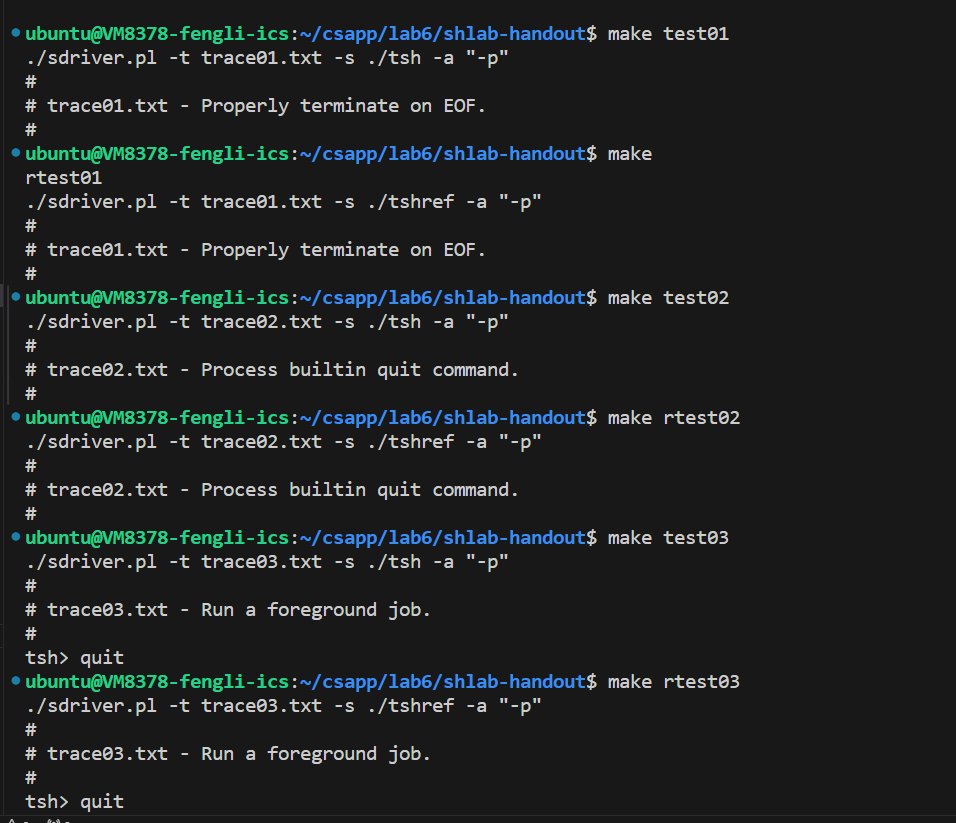
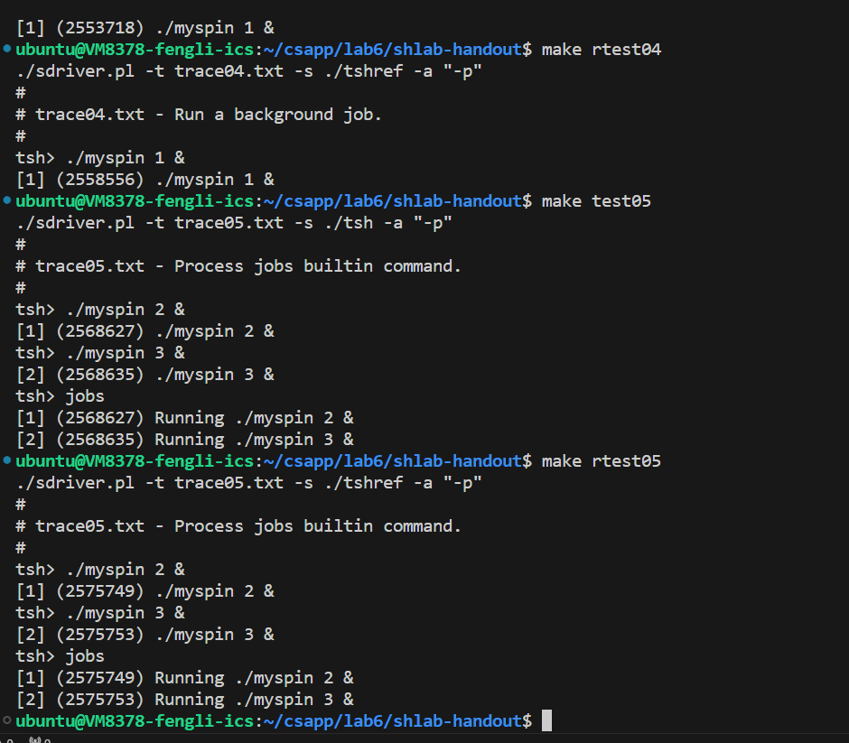
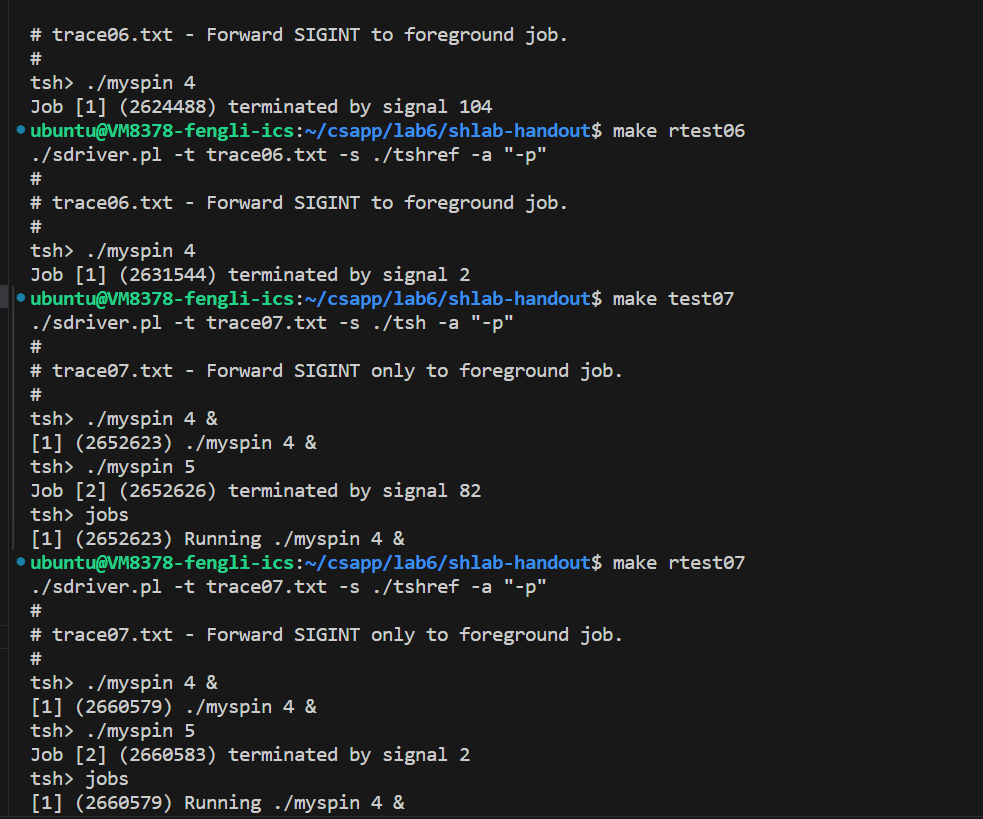
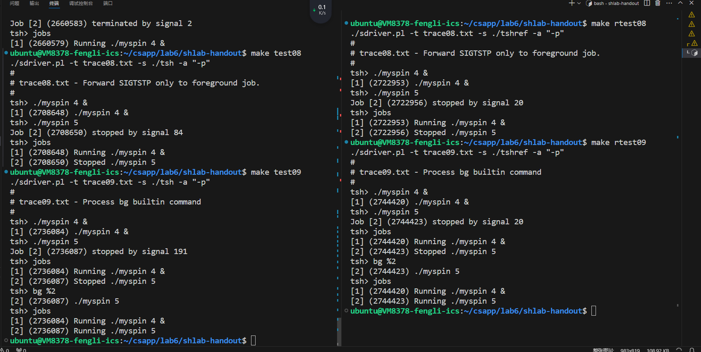
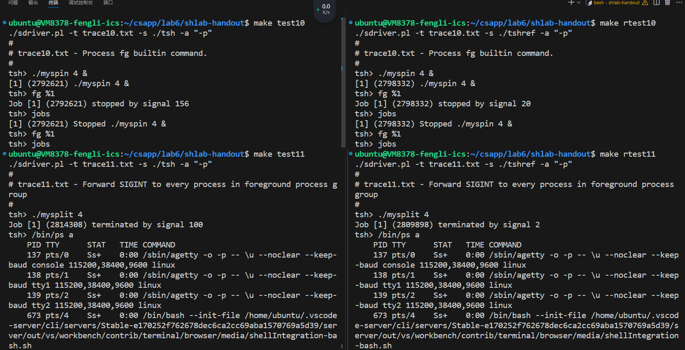
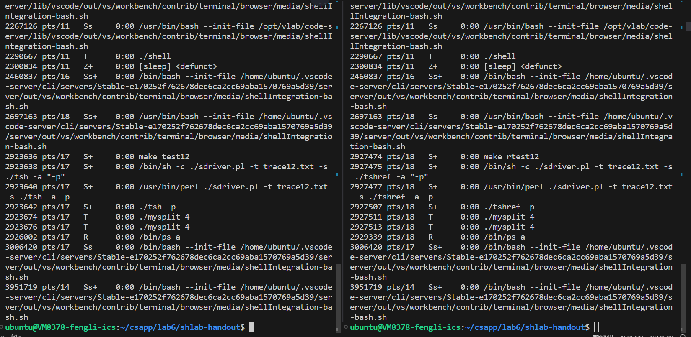
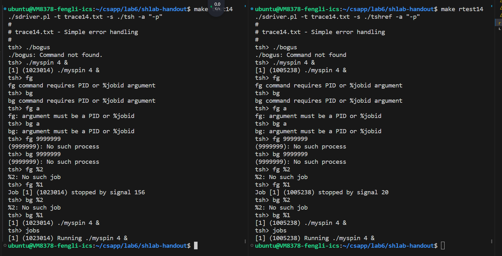
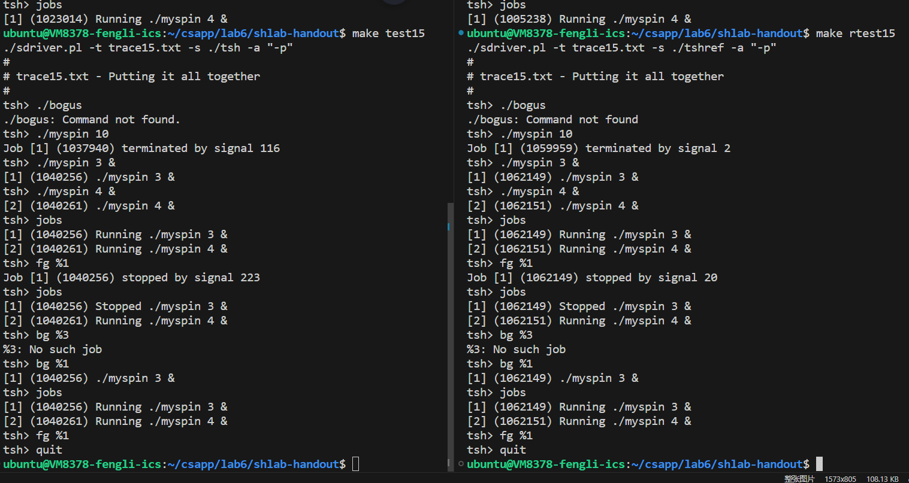
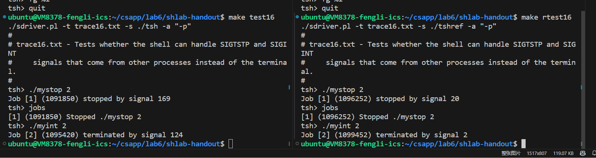

如上图。值得一提的是在测试test14时曾发现了bug，原因是在execve之后，我认为该函数会直接接管程序，所以子进程中，该函数之后的部分应该全部无效，所以在execve之后没有写exit终止错误进程。而test14应该含有了这样的错误，导致我的程序运行了两次。

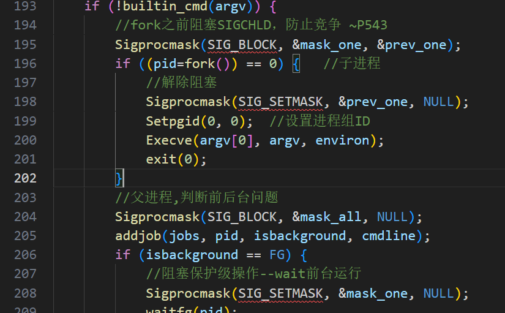

如上图，201行应该添加exit，以防止错误发生。

# 四.总结

相比于操作系统H上的shell，这个shell要显得简陋很多，`https://osh-2024.github.io/lab2/`上有我们的要求。在信号方面，我们要求ctrlc能丢弃指令，中断运行，甚至在嵌套shell里也能运行。虽然我拼拼凑凑得到了一个符合要求勉强能运行的shell，但是自学完这一章后我感觉受益良多，对并发信号的安全性有了更深层次的理解，对进程间信号传递，前后台进程管理有了更深层的认识，这样的实验时有意义的。用这样一本通用教科书来学习信号，比盲人摸象、七拼八凑的操作系统实验要专业、安全的多。

在lab6中附上操作系统实验的shell作为对比。