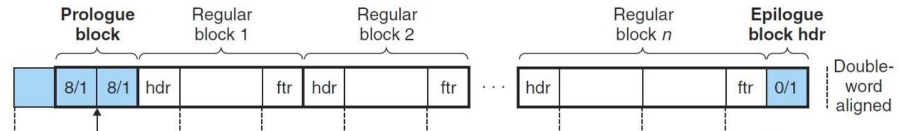
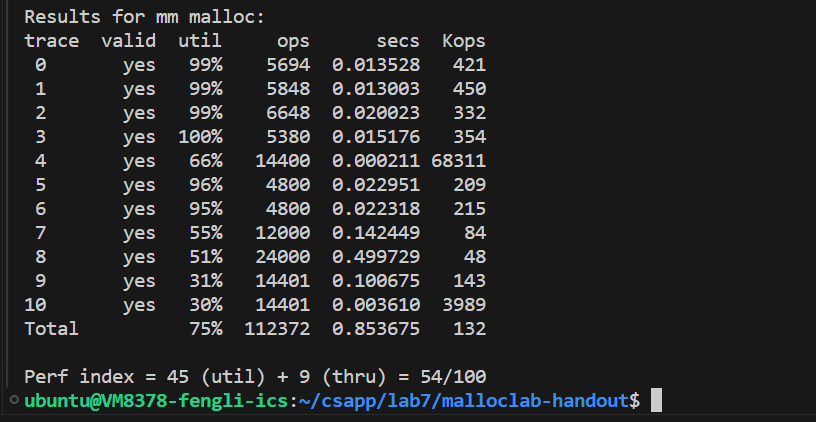
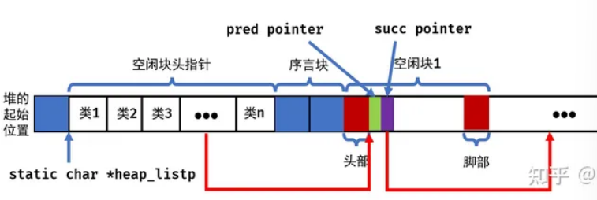
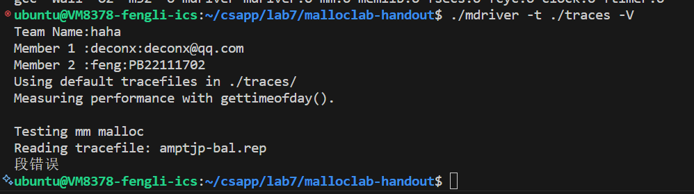
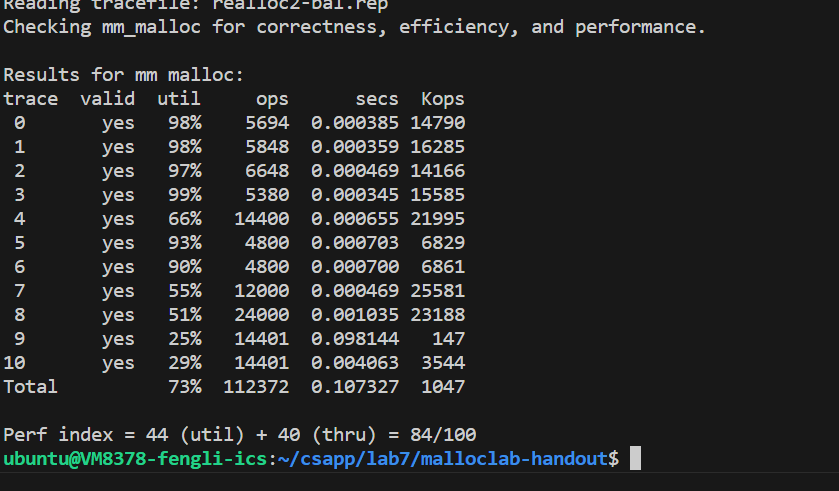

#    <center>lab7
#### <center>2024/5/10-5/12
#### <center>PB22111702 李岱峰

# 一.实验准备

 writing a dynamic storage allocator for C programs


阅读P587页教材内容

- 分配器
    - 隐式空闲链表：将堆组织为字节数组，一个连续的已分配块和空闲块序列。
    - 显示空闲链表：双向空闲链表，空闲块中包含一个前驱和后继,便于查找空闲块
    - 分离空闲链表：维护多个空闲链表，[1]、[2]、[3,4]、[5-8]...
        - 简单分离存储：每个大小类空闲链表为大小相等块
        - 分离适配：分配时可以向下一个大小类查找。
        - 伙伴系统：2的幂分配。

# 二.实验流程

## 1.隐式空闲链表

书中有，先抄一遍熟悉熟悉。P597.

### 1).总体结构



总体结构如上，每一个快都包含有头部和尾部，头=尾，都包含记录块大小(29位)和是否空闲(001\000)，中间是可分配空间

### 2).神奇宏定义

书中准备了一大批宏定义，其中：

- PACK 获得头部或尾部，因为size为8整数所以可以用|来取或运算。
- GET、PUT 用来获得指针p所对应元素和修改该元素值
- GET_size GET_ALLOC 用于得到已分配的块大小和是否被分配，是基于头部尾部的计算
- HDRP FTRP 是给定块指针，返回头和位指针
- NEXT PREV用来获得下一个和前一个块指针

注意，块指针指向被分配的第一个字，不指向头。头中的size计算的是整个块大小(算上头和尾)。

### 3).init、extend_heap

初始化时都需要：初始化头和尾，内容初始化为空，调用extend函数将块扩大，mm_init返回后，得到4K字节大小的块。

### 4).mm_free、coalesce

释放free就是将头和尾标记的"已分配"改为未分配，然后调用coalesce进行合并空闲块。

coalescs合并块，是通过获得当前块bp的前一个块和下一个块，按照书P596页分为4种情况：
- 前块和后块都被分配：不进行合并，返回
- 前面分配后面空闲: 合并next，size+
- 前面空闲后面分配：合并prev，size+，指针调至prev
- 都空闲： 全合并，size+，指针调至prev

### 5).mm_malloc

参数size，malloc应该能自动分配，如果size小于双字要求，则扩充至4字，否则为加上头和尾对双字向上取整。确定size后搜索list，获得可分配空间，若没有可分配空间，就申请一个新的块。

### 6).自定义find和place

find：适配搜索，给定参数size，在链表中获得可分配的块。

- 首次适配：从头开始搜索空闲链表，选择第一个合适的空闲块
- 最佳适配：搜索能放下请求大小的最小空闲块

```C
void *find_fit(size_t asize)
{
    void *bp;
    for(bp=heap_list;GET_SIZE(HDRP(bp))>0;bp=NEXT_BLKP(bp)){
        if((GET_SIZE(HDRP(bp))>=asize)&&(!GET_ALLOC(HDRP(bp)))){
            return bp;
        }
    }
    return NULL;
}

```

```C
void *best_fit(size_t asize){
	void *bp;
    void *best_bp = NULL;
	size_t min_size = 0;
    for(bp=heap_list;GET_SIZE(HDRP(bp))>0; bp=NEXT_BLKP(bp)){
        if((GET_SIZE(HDRP(bp))>=asize) && (!GET_ALLOC(HDRP(bp)))){
            if(min_size==0||min_size>GET_SIZE(HDRP(bp))){
                min_size=GET_SIZE(HDRP(bp));
                best_bp=bp;
            }
        }
    }
    return best_bp;
}
```
经测试，两种策略分数差不多......

place：将请求块放置在空闲块起始位置，只有当剩余部分大小等于或超过最小块大小时，进行分割。

### 7).测试

新建文件mm1.c，同时修改makefile，得到结果分数54分，说明使用隐式空闲链表不及格。




## 2.显式空闲链表


采用分离适配方案进行。在空闲块中还要加上32*2bit的pred和succ，其他块同隐式。

我们需要维护一个显式的数据结构：
- 原有数组序言块前端维护一个指针数组，指向大小类的空闲块
- 每个空闲块中加入前后指针。

添加一些针对指针的宏定义
- GET 获得指针p的位置
- GET_HEAD 根据大小类序号获得大小类链表头
- GET_PRE、GET_SUC给定块指针，获得前后块




如图就是我们要实现的结构

```
#define GET_PRE(bp) ((unsigned int *)(long)(GET(bp)))
#define GET_SUC(bp) ((unsigned int *)(long)(GET((unsigned int *)bp + 1)))

```

设置20个大小类：16、17-32、33-64......

### 1).init的更改

init过程中还需要生成指针数组，长度为20。初始化为空

### 2).search和insert

search需要找到空闲块所处的大小类，使用遍历，从最小类开始遍历

insert将空闲块插入空闲链表，来维护整个表项。我使用头插法，按照双向链表的操作进行。

### 3).delete

在空闲块被分配或被合并后，位置需要改变，改变之前先从原有位置移除。按照双向链表规则，设置好头尾即可

### 4).coalesce

合并，与之前不同的是，我们需要维护空闲链表。

- 前块和后块都被分配：不进行合并，返回+插入该块至表内
- 前面分配后面空闲: 合并next，size+，+删除后面的块、合并后insert
- 前面空闲后面分配：合并prev，size+，指针调至prev，+删除前面的块，合并后insert
- 都空闲： 全合并，size+，指针调至prev，+删除前后两个块，合并后insert

### 5).find_fit

匹配算法，从两个维度匹配：1.这个大小类中有没有合适的块(一个大小类是一个范围，有合适的有不合适的)，2.下个大小类中有没有合适的

从最匹配的那个大小类开始进行搜索，一层一层搜索。

### 6).特别注意

需要牢记的是，我们维护的只是一个空闲链表，这些已分配、待分配空间实质上在空间还是连续的，只是我们将空闲块连接了出来，串成了一个一个链表，在访问时间上可以避免遍历大量已分配块的时间开销。

### 结果



delete函数错的，首节点前驱错误设为了链表索引。
```C
 PUT(suc,heap_list+WSIZE*num)

```
导致指向了NULL段错误,我怀疑是有函数错误访问*(NULL),因该是搜索的时候用前驱搜索导致的。




得到了84分。

# 三.总结

本来想试试mini块，压缩头部和尾部的大小，使空间利用率更高，结果段错误，初步考虑是64位机器上，为了实现双字对齐，头和尾加起来必须是64位，这相当于没压缩。或者可以减小块大小，祖先后继和头尾共同拼接成64位，这样就可以提高空间利用率，相应问题是寻址空间会减小不少。