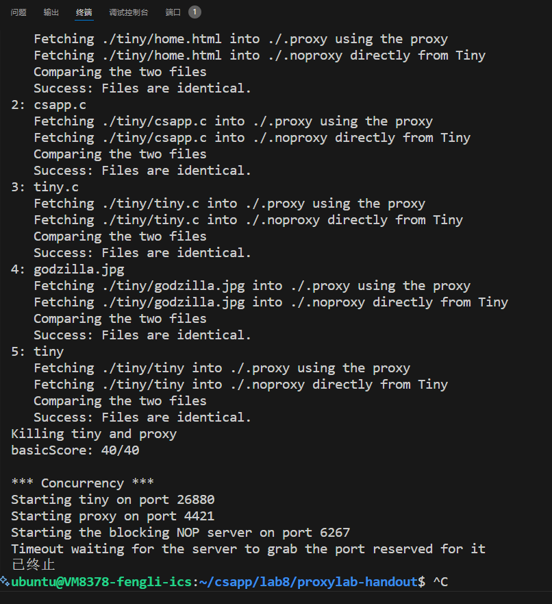
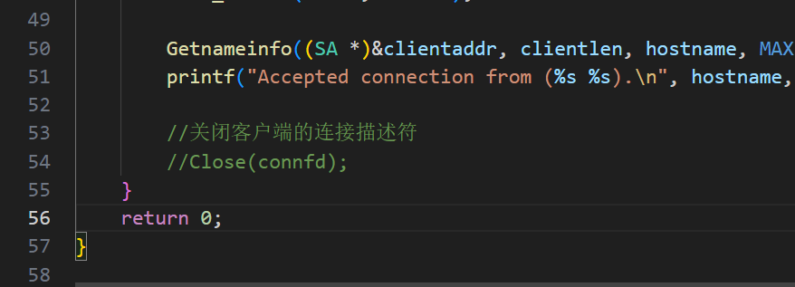
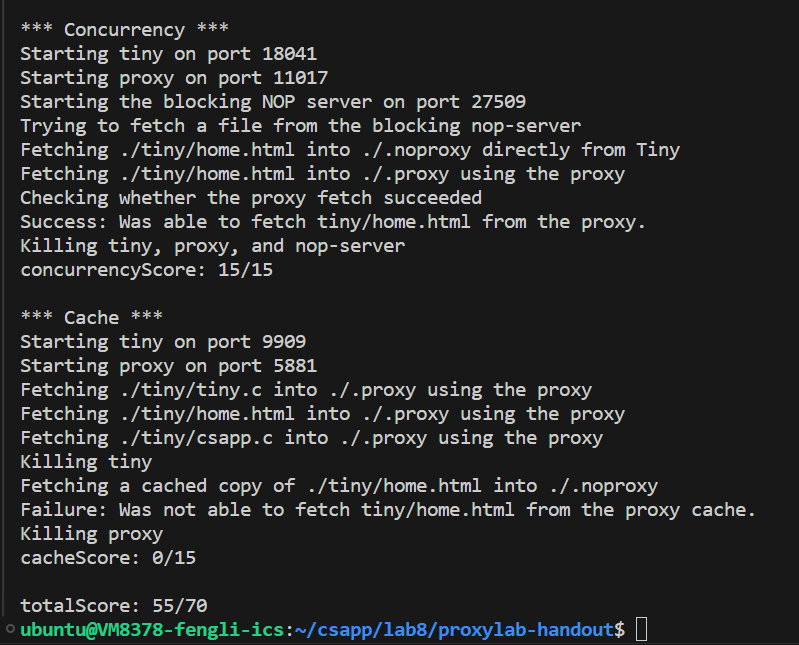
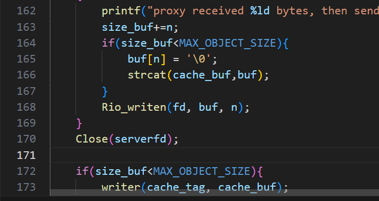

#    
lab8
#### 
2024/5/2-2024/5/3
#### 
PB22111702 李岱峰

# 一.实验准备

因为紧急原因，操作系统H课产生了lab3 `https://osh-2024.github.io/lab3/`.是关于网络服务器的编程。因为该课文档过于简略，我决定先行完成lab8 proxylab作为前置，祝我好运！

在充分阅读csapp教材第11、12章后，我对socket编程、服务器模式、并发设计有了一定的了解，并手动尝试了一下作者提供的tinyweb-server，在准备充分的前提下，开始本次实验。

# 二.实验过程

##  1.PartI: Implementing a sequential web proxy

Proxy是client端和webserver端的中间部件，负责转发功能，在这一节，我需要

>listen for incoming connections on a port whose number will be specified on the command line.

>read the entirety of the request from the client and parse the request. It should determine whether the client has sent a valid HTTP request;

>establish its own connection to the appropriate web server then request the object the client
 specified.
 
>read the server’s response and forward it to the client

我需要完成解析字符串部分，包括替换HTTP/1.1->HTTP/1.0。获得主机名，网页地址等

main函数部分与tiny相同,todo部分与server不同，这里不需要进行信息处理，而是信息转发。Parse_uri的处理方式和tiny类似，我们需要将一串请求切割为主机名、端口号、路径即可。头部处理用来生成报文头部，指示连接状态。

如图，转接正常。

##  2.PartII: Dealing with multiple concurrent requests

即考虑12章的部分，用三种并发处理的一种来解决多个用户端请求的问题。上面的程序被叫做顺序执行，在面对多个用户时很慢且所有人都需要按顺序等待，而并发处理可以解决这个问题。

考虑多线程编程技术，考虑生产者消费者模型，这个模型可以构建一个队列，将多个用户看作生产者，webserver响应看作消费者，互斥的访问浏览器资源，达到并发访问web的目的。同时采取预线程化方式，即书P708页内容。

借助csapp书P705页的内容，引进SBUF包来解决问题。我新建一个SBUF.c文件，在handout包中可见，同时修改makefile

预线程是在开始监听之前，先进产生一些子线程，这些子线程数量是一定的，这相当于在开机时进行，而不是在机器运行时，来一个客户就开一个线程，这可以减少时间开销。而由于线程个数是有限的，有限的资源就产生了资源共享问题，队列长度是一定的，符合生产者消费者模型，该模型用来解决资源互斥使用的问题，避免过多生产者(client)同时访问造成竞争。

### 需要特别注意的是下图，不能随手将main函数中的connfd关闭，否则相当于在线程里关闭一次，然后main中对已经关闭的线程又关闭了一次。尤其是多个线程在一个进程里，他们是共享数据的，共享这个文件描述符，关闭两次肯定是错误的。

如图，第二部分完成。

## 3.PartIII: Caching web objects

将cache加入到proxy上，是一个很有意思的想法。根据组成原理的知识，cache要解决两个问题：匹配和替换。
这里的替换我采用LRU算法进行替换。LRU即最近最少使用策略，替换最后一次访问时间最久远的一行。、

同时，cache在proxy的内部，作用是当两个client访问时，如果先后访问同一个站点，则第二个访问用户会得到cache中记录的结果，而不是再占用一个线程获取一遍。但这就又有了竞争问题，所以引入读者写者模型，即proxy写，用户读，读优先(为了快)，读的时候锁死写。

值得注意的是：buf 可能不是以 null 结尾的：Rio_readlineb 函数读取一行数据到 buf，但是它不会在数据的末尾添加 null 字符，这可能导致程序卡停。如下图。

另外，cache需要初始化，否则程序会卡死。

这是最终结果

# 三.总结

完成了web+并发实验，体验了两种并发模型，这将会对我接下来的web-server编写提供充足的理论指导。一些函数的运用的确让人眼前一亮。
